# GT (General Trading) Complete Workflow Diagram

## 🔄 COMPLETE WORKFLOW PATH ANALYSIS

```mermaid
graph TD
    %% SALES ORDER CREATION
    SO[📋 Sales Order Created] --> SO_NOTIF{Create PPIC Notification?}
    SO_NOTIF -->|YES| PPIC_NOTIF[📧 gt_ppicNotifications<br/>type: SO_CREATED<br/>status: PENDING]
    SO_NOTIF -->|NO| SO_STORED[💾 gt_salesOrders]
    
    %% PPIC WORKFLOW
    PPIC_NOTIF --> PPIC_READ[👁️ PPIC Reads Notifications<br/>from gt_ppicNotifications]
    PPIC_READ --> SPK_CREATE[📝 Create SPK from SO]
    SPK_CREATE --> SPK_STORED[💾 gt_spk<br/>status: OPEN]
    SPK_CREATE --> PPIC_NOTIF_PROCESSED[✅ Update Notification<br/>status: PROCESSED]
    
    %% INVENTORY CHECK & PR CREATION
    SPK_STORED --> INV_CHECK{Check Inventory<br/>Stock Available?}
    INV_CHECK -->|YES| SPK_FULFILLED[✅ SPK stockFulfilled: true]
    INV_CHECK -->|NO| PR_CREATE[📝 Create Purchase Request]
    
    PR_CREATE --> PR_STORED[💾 gt_purchaseRequests]
    PR_CREATE --> PURCHASING_NOTIF[📧 gt_purchasingNotifications<br/>type: PR_CREATED<br/>status: PENDING]
    
    %% PURCHASING WORKFLOW
    PURCHASING_NOTIF --> PURCHASING_READ[👁️ Purchasing Reads PR Notifications]
    PURCHASING_READ --> PO_CREATE[📝 Create Purchase Order]
    PO_CREATE --> PO_STORED[💾 gt_purchaseOrders]
    PO_CREATE --> PR_PROCESSED[✅ Update PR status: PROCESSED]
    
    %% GOODS RECEIPT
    PO_STORED --> GRN_CREATE[📦 Create Goods Receipt Note]
    GRN_CREATE --> GRN_STORED[💾 gt_grn]
    GRN_CREATE --> INV_UPDATE[📈 Update Inventory]
    GRN_CREATE --> FINANCE_NOTIF[📧 gt_financeNotifications<br/>type: SUPPLIER_PAYMENT<br/>status: PENDING]
    GRN_CREATE --> PPIC_STOCK_NOTIF[📧 gt_ppicNotifications<br/>type: STOCK_READY<br/>status: PENDING]
    
    %% BACK TO PPIC - STOCK READY
    PPIC_STOCK_NOTIF --> PPIC_STOCK_READ[👁️ PPIC Reads Stock Ready]
    PPIC_STOCK_READ --> SPK_STOCK_UPDATE[✅ Update SPK<br/>stockFulfilled: true]
    PPIC_STOCK_READ --> DELIVERY_NOTIF_CREATE[📧 gt_deliveryNotifications<br/>type: READY_TO_SHIP<br/>status: PENDING]
    
    %% DELIVERY SCHEDULING
    SPK_FULFILLED --> SCHEDULE_CREATE[📅 Create Delivery Schedule]
    SPK_STOCK_UPDATE --> SCHEDULE_CREATE
    SCHEDULE_CREATE --> SCHEDULE_STORED[💾 gt_schedule<br/>deliveryBatches]
    SCHEDULE_CREATE --> DELIVERY_NOTIF_SCHEDULE[📧 gt_deliveryNotifications<br/>type: READY_TO_DELIVER<br/>per sjGroupId]
    
    %% DELIVERY NOTE CREATION
    DELIVERY_NOTIF_CREATE --> DN_READ[👁️ Delivery Note Reads Notifications]
    DELIVERY_NOTIF_SCHEDULE --> DN_READ
    DN_READ --> DN_CREATE[📋 Create Delivery Note]
    DN_CREATE --> DN_STORED[💾 gt_delivery<br/>status: OPEN]
    DN_CREATE --> DELIVERY_NOTIF_PROCESSED[✅ Update Delivery Notifications<br/>status: DELIVERY_CREATED]
    
    %% DELIVERY CONFIRMATION
    DN_STORED --> DN_CONFIRM[✅ Confirm Delivery<br/>status: CLOSE/DELIVERED]
    DN_CONFIRM --> SPK_CLOSE[✅ Update SPK<br/>status: CLOSE]
    DN_CONFIRM --> INVOICE_NOTIF[📧 gt_invoiceNotifications<br/>type: CUSTOMER_INVOICE<br/>status: PENDING]
    
    %% INVOICE CREATION
    INVOICE_NOTIF --> INVOICE_READ[👁️ Invoice Module Reads Notifications]
    INVOICE_READ --> INVOICE_CREATE[📄 Create Customer Invoice]
    INVOICE_CREATE --> INVOICE_STORED[💾 gt_invoices]
    INVOICE_CREATE --> AR_CREATE[💰 Create Accounts Receivable]
    INVOICE_CREATE --> INVOICE_NOTIF_PROCESSED[✅ Update Invoice Notification<br/>status: PROCESSED]
    
    %% CUSTOMER PAYMENT
    AR_CREATE --> AR_STORED[💾 gt_accountsReceivable]
    AR_STORED --> CUSTOMER_PAY[💳 Customer Payment Received]
    CUSTOMER_PAY --> AR_CLOSE[✅ Close AR<br/>status: PAID]
    CUSTOMER_PAY --> SO_CLOSE[✅ Close Sales Order<br/>status: CLOSE]
    
    %% SUPPLIER PAYMENT
    FINANCE_NOTIF --> FINANCE_READ[👁️ Finance Reads Payment Notifications]
    FINANCE_READ --> SUPPLIER_PAY[💳 Create Supplier Payment]
    SUPPLIER_PAY --> PAYMENT_STORED[💾 gt_payments]
    SUPPLIER_PAY --> FINANCE_NOTIF_PROCESSED[✅ Update Finance Notification<br/>status: PROCESSED]
    SUPPLIER_PAY --> PO_CLOSE[✅ Close Purchase Order<br/>status: PAID]

    %% STYLING
    classDef storage fill:#e1f5fe,stroke:#01579b,stroke-width:2px
    classDef notification fill:#fff3e0,stroke:#e65100,stroke-width:2px
    classDef process fill:#e8f5e8,stroke:#2e7d32,stroke-width:2px
    classDef decision fill:#fce4ec,stroke:#c2185b,stroke-width:2px
    classDef finance fill:#f3e5f5,stroke:#7b1fa2,stroke-width:2px
    
    class SO_STORED,SPK_STORED,PR_STORED,PO_STORED,GRN_STORED,SCHEDULE_STORED,DN_STORED,INVOICE_STORED,AR_STORED,PAYMENT_STORED storage
    class PPIC_NOTIF,PURCHASING_NOTIF,FINANCE_NOTIF,PPIC_STOCK_NOTIF,DELIVERY_NOTIF_CREATE,DELIVERY_NOTIF_SCHEDULE,INVOICE_NOTIF notification
    class SO,SPK_CREATE,PR_CREATE,PO_CREATE,GRN_CREATE,SCHEDULE_CREATE,DN_CREATE,INVOICE_CREATE process
    class SO_NOTIF,INV_CHECK decision
    class SUPPLIER_PAY,CUSTOMER_PAY,AR_CREATE finance
```



## 📊 NOTIFICATION TYPES & STORAGE KEYS

### 1. PPIC Notifications (`gt_ppicNotifications`)
```typescript
// SO Created → PPIC
{
  type: 'SO_CREATED',
  status: 'PENDING' → 'PROCESSED',
  soNo: string,
  customer: string,
  items: Array
}

// Stock Ready → PPIC (from GRN)
{
  type: 'STOCK_READY',
  status: 'PENDING' → 'PROCESSED',
  spkNo: string,
  productId: string,
  qty: number
}
```

### 2. Purchasing Notifications (`gt_purchasingNotifications`)
```typescript
// PR Created → Purchasing
{
  type: 'PR_CREATED',
  status: 'PENDING' → 'PROCESSED',
  prNo: string,
  spkNo: string,
  productId: string,
  qty: number
}
```

### 3. Delivery Notifications (`gt_deliveryNotifications`)
```typescript
// Ready to Ship (from PPIC stock check)
{
  type: 'READY_TO_SHIP',
  status: 'PENDING' → 'DELIVERY_CREATED',
  spkNo: string,
  stockFulfilled: true
}

// Ready to Deliver (from PPIC schedule)
{
  type: 'READY_TO_DELIVER',
  status: 'PENDING' → 'DELIVERY_CREATED',
  spkNo: string,
  sjGroupId: string,
  deliveryBatches: Array
}
```

### 4. Finance Notifications (`gt_financeNotifications`)
```typescript
// Supplier Payment (from GRN)
{
  type: 'SUPPLIER_PAYMENT',
  status: 'PENDING' → 'PROCESSED',
  poNo: string,
  grnNo: string,
  supplierName: string,
  totalAmount: number
}
```

### 5. Invoice Notifications (`gt_invoiceNotifications`)
```typescript
// Customer Invoice (from Delivery)
{
  type: 'CUSTOMER_INVOICE',
  status: 'PENDING' → 'PROCESSED',
  soNo: string,
  deliveryNo: string,
  customer: string,
  totalAmount: number
}
```

## 🔍 CROSS-DEVICE SYNC ANALYSIS

### ✅ WORKING SYNC PATHS
1. **SO → PPIC**: ✅ Fixed (gt_ppicNotifications)
2. **PPIC → Purchasing**: ✅ Working (gt_purchasingNotifications)
3. **GRN → Finance**: ✅ Working (gt_financeNotifications)
4. **GRN → PPIC**: ✅ Working (gt_ppicNotifications type: STOCK_READY)

### ⚠️ POTENTIAL SYNC ISSUES TO CHECK
1. **PPIC → Delivery**: Check if gt_deliveryNotifications sync properly
2. **Delivery → Invoice**: Check if gt_invoiceNotifications created correctly
3. **Schedule → Delivery**: Check if sjGroupId sync works across devices

## 🛠️ DATA STORAGE KEYS

### Core Data
- `gt_salesOrders` - Sales Orders
- `gt_spk` - SPK (Surat Perintah Kerja)
- `gt_purchaseRequests` - Purchase Requests
- `gt_purchaseOrders` - Purchase Orders
- `gt_grn` - Goods Receipt Notes
- `gt_schedule` - Delivery Schedules
- `gt_delivery` - Delivery Notes
- `gt_invoices` - Customer Invoices
- `gt_payments` - Supplier Payments
- `gt_accountsReceivable` - Customer AR

### Notifications
- `gt_ppicNotifications` - PPIC notifications
- `gt_purchasingNotifications` - Purchasing notifications
- `gt_deliveryNotifications` - Delivery notifications
- `gt_financeNotifications` - Finance notifications
- `gt_invoiceNotifications` - Invoice notifications

### Master Data
- `gt_customers` - Customer master
- `gt_products` - Product master
- `gt_inventory` - Inventory data

## 🚨 CRITICAL SYNC POINTS TO VERIFY

1. **SO Confirm → PPIC**: ✅ FIXED
2. **SPK Create → Inventory Check**: Need to verify
3. **GRN Create → PPIC Stock Update**: Need to verify
4. **Schedule Create → Delivery Notifications**: Need to verify
5. **Delivery Confirm → Invoice Notifications**: Need to verify
6. **Payment Create → PO Close**: Need to verify

## 📋 NEXT STEPS FOR VERIFICATION

1. Test SO creation and PPIC notification sync
2. Test SPK creation and inventory check
3. Test PR creation and purchasing notification
4. Test GRN creation and finance notification
5. Test delivery scheduling and notification sync
6. Test delivery confirmation and invoice notification
7. Test payment creation and PO closure

This diagram shows the complete GT workflow with all notification paths and sync points.